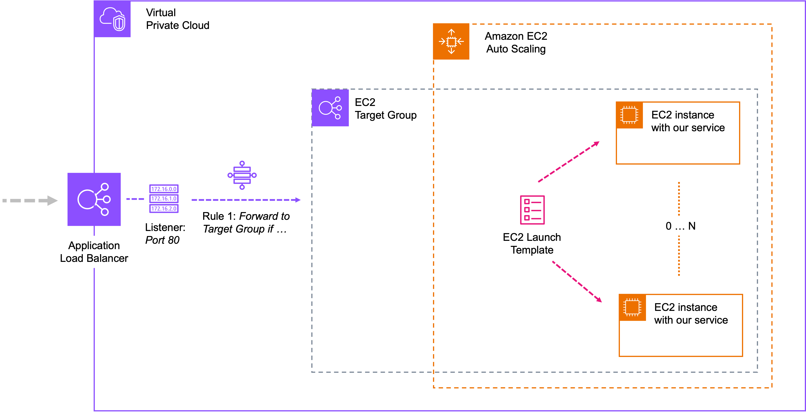

# Hands-On Cloud Workshop
powered by [open knowledge](https://www.openknowledge.de)

## Step 1b: Lift & Shift (extended version)

In this exercise, we want to take the current status of the lift & shift cloud solution 
to the next level. To this end, we will automate the process of provisioning and thus 
make it reproducible. Instead of installing the Java runtime and the backend service manually, 
we will use an EC2 launch template.

In addition, we will scale our service to more than one instance and use a load balancer to route the 
incoming traffic to one of these instances. The load balancer helps us to connect the internet with the 
internal cloud environment by securing and forwarding the external calls to a so-called target group. The 
target group in turn routes the incoming calls to the available targets (aka EC2 instances).

The following image illustrates the relationships between load balancer, target group and 
targets (aka available EC2 instances): 

[](AppRunner_overview.png)

See also [AWS target groups for your application Load Balancers](https://docs.aws.amazon.com/elasticloadbalancing/latest/application/load-balancer-target-groups.html) 
for more details. 

During this exercise you will learn how to:

- Log into the AWS Cloud 
- Create an EC2 launch template
- Create a target group for routing purpose
- Create a load balancer delegating incoming traffic to the target group 
- Create an autoscaling group using the launch template   
- Test your setup from the internet (aka from "out of the cloud")  
- Connect the frontend to the backend making use of the load balancer 


**Note:**
> Make sure you are on branch `1b_lift_and_shift`.

### Log into the AWS Cloud

**Note**: This step is only necessary if you are not already logged in. 

First of all we have to connect to the AWS Cloud:

1. Go to https://console.aws.amazon.com/console/home
2. Select "IAM user sign in" if not already preselected
3. Use the user information provided to you to sign in
    - Account ID: [WORKSHOP ACCOUNT ID]
    - IAM username: [YOUR ANIMAL]
    - Password: [YOUR ANIMAL PWD]

After successfully logged in You should see the AWS CLoud main dashboard.

**Note**: Make sure the region in the upper right corner of the browser window
is set to "Europe (Frankfurt)" aka eu-central-1.

### Create an EC2 launch template

To create an EC2 launch template we have to call the EC2 service configuration webpage first.

As already shown in the previous exercise, there are several ways to call the EC2 service configuration webpage:

- use global quick search and lookup for "EC2"
- select EC2 service from service overview via "compute"
- select EC2 service from "recently visited" (if available)

Next, use the EC2 service dashboard to create a launch template:

1. Select "Launch Templates" from the EC2 Instance menu (left border of the dashboard). This will 
lead you to the "Create launch template" page that looks very similar to the "Create Instance" from 
our last exercise.
2. Fill in the following values (and leave everything else as is):
   - Launch template name and description: use your animal as prefix, e.g. dog-launch-template.
   - Application and OS images: Select the most recent Amazon Linux as OS (should be preselected). 
   - Instance type: select t3a.nano 
   - Key pair: select "Don't include in launch template"
   - Network settings:
     - click "Select existing security group"
     - select the predefined workshop security group "EC2"
   - Open "Advanced details" block:
     - select the predefined IAM instance profile "EC2"
   - User data: copy the following snippet

        ```sh
        #!/bin/bash
        
        echo Update all packages
        yum -y update
        
        echo Install Java 21
        yum -y install java-21-amazon-corretto-headless
        
        echo Download app
        wget https://github.com/openknowledge/workshop-cloud/releases/download/v2/v2.jar -O app.jar
        
        echo Start app
        java -jar app.jar --server.port=80
        ```

   **Note**: Feel free to take a look at all the other configuration topics and options.

   Finally, click "Create launch template". You will see a success page when everything done right.

### Create a target group for routing purpose

Think of a target group as an internal load balancer. The target groups takes incoming request - delegated to it 
by an application load balancer - and forwards these to the available targets (aka EC2 instances). 

1. Goto EC2 service dashboard
2. Select "Target Group" from the EC2 Load Balancers menu
3. Click "Create target group". This will lead you to page "Step 1 of 2" of the Create Target Group Wizard. 
4. Fill in the following values for "Step 1 of 2": 
   - Target group name: use your animal as prefix, e.g. dog-target-group
   - Health check path: `/id`
   - click "next" button (this will lead you to "Step 2 of 2")
5. Fill in the following values for "Step 2 of 2":
   - no further action required  
   - click "Create target group"

When everything done right, you will see a success page with an empty - so far no targets defined - target group. 

### Create a load balancer for the target group   

Next we will create an application load balancer to allow external access from the internet to 
our internal target group:  

1. Goto EC2 service dashboard
2. Select "Load Balancers" from the EC2 Load Balancers menu
3. Click "Create load balancer". This will lead you to an interims page to select the requested load balancer type. 
4. Click "Create" button of the "Application Load Balancer" choice. This will lead you to the "Create Application load balancer" page.
   - Load balancer name: use your animal as prefix, e.g. dog-load-balancer
   - Availability Zones: choose all three
   - Security groups: EC2 
   - Listeners and routing: choose your target group for port 80

**Note**: Leave everything else as is but feel free to read the different configuration topics and options.

Finally, click "Create load balancer". You will see a success page when everything done right.

### Create an auto-scaling group 

Now it is time to connect all the different cloud elements we have set up so far with the help of an EC2 
auto-scaling group:  

1. Goto EC2 service dashboard
2. Select "Auto Scaling Group" from the EC2 Auto Scaling menu
3. Click "Create Auto Scaling group". This will lead you Step 1 of 7 of the Create Auto Scaling group wizard.
4. Wizard Step 1 of 7:
   - Auto scaling group name: use your animal as prefix, e.g. dog-auto-scaling-group
   - Launch template: choose YOUR launch template
   - click "Next" button 
5. Wizard Step 2 of 7:
   - Availability Zones and subnets: choose all three of your subnets
   - click "Next" button
6. Wizard Step 3 of 7:
   - Load balancing: select "Attach to an existing load balancer"
   - Existing load balancer target group: select YOUR target group 
   - Health checks: turn on Elastic Load Balancing health checks
   - click "Next" button
7. Wizard Step 4 of 7:
   - set desired capacity to 2 (instead of only 1) 
   - click "Next" button as long as reaching the last "Step 7 of 7: Review"
8. Wizard Step 7 of 7: 
   - Review all your settings. Make sure that the following components are set correctly: 
     - [x] Launch template: YOUR launch template 
     - [x] subnets: all three of YOUR subnets
     - [x] load balancer: YOUR load balancer 
     - [x] target group: YOUR target group 
     - [x] desired capacity: 2 [x]
   - click "Create Auto Scaling group"

You will see a success page when everything done right showing the so far created auto-scaling groups by you and 
all the other workshop attendees. 

### Quick-test your setup 

During this exercise we have set up and connected a lot of different cloud components. When everything done right
the incoming calls should be handled and forwarded by the application load balancer to the referenced target group. 
This is because the target group is not accessible from the outside by purpose for security reasons. 

Next, the target group routes the incoming call from the load balancer to one of its targets which in our case 
is one of two EC2 instances automatically created with the help of a launch template and running our backend service. 

To test this setup we simply have to call our scaled backend service via the application load balancer.
Therefore we have to look up the load balancer public URL first and then call our service using this url. 

1. Goto EC2 service dashboard
2. Select "Load Balancers" from the EC2 Load Balancers menu 
3. Select YOUR load balancer from the list of available load balancers
4. Make sure the state of the load balancer is "Active". If the state is still "Provisioning" get a coffee and wait 
until it turns to active. This may take several minutes.
5. Copy load balancers DNS name
6. Call the health check URL to return the individual ID of the triggered EC2 instance.
Use a browser, Postman or whatever to send the call (http GET-request):
   ```
   http://[LOAD_BALANCER_DNS]/id
   ```
**Not**: Reload a few time to check if all instances are hit eventually.

### Connecting frontend and backend

_DRAFT VERSION - CHANGES MY OCCUR DUE TO CODESPACES TLS ISSUE_

Finally, we want to connect our frontend to the cloud based backend service with the help of the 
application load balancer and all the other cloud components we just created. 

As already shown in the previous exercises, to do so we have to reference the above evaluated 
application load balancer URL (aka LOAD_BALANCER_DNS) from the frontend showcases configuration 
typescript file `showcases.ts`:

**Note**: You can skip step 1 if you have the load balancer dns name already available. 

1. Lookup application load balancers URL via EC2 dashboard
    - select Load Balancers from the EC2 Load Balancers menu
    - choose YOUR  load balancer instance
    - copy the DNS name of the load balancer 

2. Go to the typescript file `showcases.ts` that can be found in ./frontend/src of your frontend
   project. Replace the fake URL `baseUrl: http://todo.invalid` of the entry "1 – Lift & Shift" with
   the valid URL of the backend. The result should look like.

    ```typescript
    export const SHOWCASES: ShowcaseConfig = {
        ...
        "1 – Lift & Shift": {
            baseUrl: "http://[LOAD_BALANCER_DNS]",
        },
        ...
    }
    ```   

3. Open the ok-forum app in a browser of your choice (URL see above) and select the showcase "1 – Lift & Shift"
   in the dropdown.

4. Check if the ok-forum app works properly by clicking through the forums categories, topics and
   discussions.

**Note**: Feel free to delete all resources you've created (in reverse order)

### Congratulations ...

Wow, that was a blast! But there is still a lot of Cloud-stuff to learn. 

Let's take a look at MANAGED SERVICES ...


